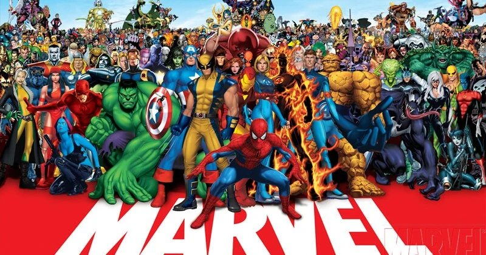

# Seleção de Personagens da Marvel 

 
 

# Descrição do Projeto

Projeto desenvolvido junto dos professores do Dev Quest. Neste projeto você pode selecionar um personagem passando o ponteiro do seu mouse por cima, fazendo com que apareça o nome e a imagem do personagem que você optou

 
 

# Tecnologias Utilizadas 🛠

-   # HTML
-   # CSS
-   # JavaScript
 
 

# Projeto Funcionando e Responsividade 💻📱

## Seleção de Escolha

 

Note que por conta do P2 ja ter escolhido o personagem Ultron, o P1 não pode escolhe-lo mais, por conta disso ele não aparece quando o mouse passa por cima dele.

 
 

## Responsividade 🔨

 

### Nivel 1

---

 

 
 

### Nivel 2

---

 

